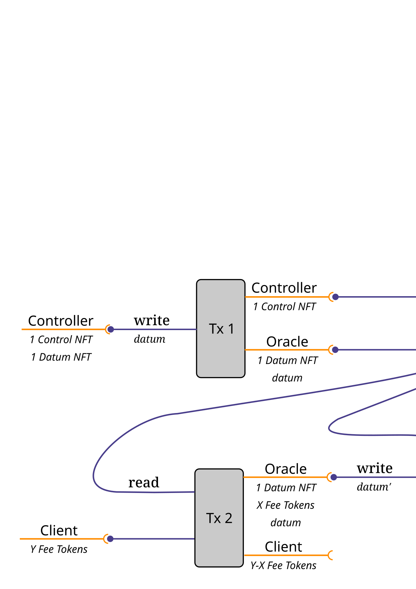

A General-Purpose Token-Based Oracle for Cardano
================================================

This Cardano oracle reports structured data (namely, the `PlutuxTx.BuiltinData` type) to a transaction if the fee, as a quantity of a fungible token, is paid. It can be incorporated into other smart-contract scripts that use the oracle's value in their validation logic.

Parameters
----------

The oracle is parameterized as follows:

    data Parameters =
      Parameters
      {
        controlParameter :: AssetClass
      , datumParameter   :: AssetClass
      , feeToken         :: AssetClass
      , feeAmount        :: Integer
      , lovelaceAmount   :: Integer
      }

*   The `controlParameter` specifies a native token the that controller (owner) of the oracle uses to update the oracle's value, withdraw funds, or close (delete) the oracle.
*   The `datumParameter` specifies the non-fungible token that identifies the UTxO containing the oracle data.
*   The quantity `feeAmount` of the fungible token `feeToken` must be paid to the oracle in order to read its value in an on-chain validator.
*   The quantity `lovelaceAmount` of ADA must be paid to the oracle in order to read its value in an on-chain validator.

Actions
-------

The oracle can perform three simple actions:

    data Action =
        Delete
      | Read
      | Write

*   The `Read` action simply reads the value of the oracle into a transaction, and corresponds to the `read` endpoint in [`Mantis.Oracle.Client`](src/Mantis/Oracle/Client.hs). The required fee must be paid to the oracle script, and the UTxO containing the oracle data must be consumed and paid back to the oracle script, with the data unchanged.
*   The `Write` action updates the value of the oracle, and corresponds to the `write` endpoint in [`Mantis.Oracle.Controller`](src/Mantis/Oracle/Controller.hs). The control token (specified by `controlParameter`) must be present in the transaction, and the UTxO containing the oracle data must be consumed and paid back (with the revised data) to the oracle script.
*   The `Delete` action shuts down the oracle by removing the data and associated NFT, and corresponds to the `delete` endpoint in [`Mantis.Oracle.Controller`](src/Mantis/Oracle/Controller.hs). The control token must be present in the transaction.

Usage
-----

The oracle can be incorporated into other smart-contract scripts that use the oracle's value in their validation logic via the `Read` redeemer. Here is an example use case of creating, reading, and writing to the oracle.

Installation
------------

This package uses the [`haskell.nix`](https://input-output-hk.github.io/haskell.nix/) build system. Simply clone this repository and execute the build command:

    nix-build -A mantis-oracle.components.exes.mantis-oracle -o build

The executable result will be in `./build/bin/mantis-oracle`.

Alternatively, one can use the `cabal install` installation approach, which relies on the [cabal.project](cabal.project) file and which is known to succeed with cabal 3.4.0.0 and ghc 8.10.4.

Example using the command line
------------------------------

This example assumes the following:

*   Version 1.29.0-rc2 of `cardano-node` and the bundled version of `cardano-cli`.
*   `alonzo-purple.payment-0.address` contains the address of a wallet funded with test ADA.
*   `alonzo-purple.payment-0.skey` contains the corresponding signing key for the above address.
*   `alonzo-purple.payment-0.vkey` contains the corresponding verification key for the above address.
*   `alonzo-purple.payment-1.address` contains the address of a (possibly empty) address for use in the example.
*   `alonzo-purple.payment-1.skey` contains the corresponding signing key for the above address.
*   The control token for the oracle is named `tBRIO`.
*   The datum token for the oracle is named `tSOFR`.
*   The fee token for the oracle is named `tPIGY`.
*   Five of the `tPIGY` tokens are needed to read the oracle, but no additional ADA is needed, aside from the transaction fee.
*   The `mantis-oracle` executable program is on the search path, given by the `PATH` environment variable.

### Set up the network.

    MAGIC="--testnet-magic 8"
    
    cardano-cli query protocol-parameters $MAGIC --out-file alonzo-purple.protocol

### Record the test addresses.

    ADDRESS_0=$(cat alonzo-purple.payment-0.address); echo $ADDRESS_0
    
    ADDRESS_1=$(cat alonzo-purple.payment-1.address); echo $ADDRESS_1

### Create the minting policy.

    cat << EOI > alonzo-purple.policy-0.script
    {
        "type" : "sig"
    ,   "keyHash" : "$(cardano-cli address key-hash --payment-verification-key-file alonzo-purple.payment-0.vkey)"
    }
    EOI
    
    CURRENCY=$(cardano-cli transaction policyid --script-file alonzo-purple.policy-0.script); echo $CURRENCY

### Configure the command-line tool.

We use a configuration file like [alonzo-purple.mantis-oracle](alonzo-purple.mantis-oracle). Modify the path to the local node socket, and modify policy ID for the three assets to match `$CURRENCY`.

    Configuration
    {
      socketPath     = "/data/alonzo.socket"
    , magic          = Just 8
    , epochSlots     = 43200
    , controlAsset   = "13a3efd825703a352a8f71f4e2758d08c28c564e8dfcce9f77776ad1.tBRIO"
    , datumAsset     = "13a3efd825703a352a8f71f4e2758d08c28c564e8dfcce9f77776ad1.tSOFR"
    , feeAsset       = "13a3efd825703a352a8f71f4e2758d08c28c564e8dfcce9f77776ad1.tPIGY"
    , feeAmount      = 5
    , lovelaceAmount = 0
    }

### Create the script address.

First, learn about the `export` command:

    $ mantis-oracle export --help
    
    Usage: mantis-oracle export CONFIG_FILE OUTPUT_FILE
    
      Export the validator code and compute its address.
    
    Available options:
      CONFIG_FILE              The configuration file.
      OUTPUT_FILE              Output filename for the serialized validator.
      -h,--help                Show this help text

Now export the Plutus script for the oracle and find its address:

    SCRIPT_FILE=alonzo-purple.plutus; echo $SCRIPT_FILE
    
    mantis-oracle export alonzo-purple.mantis-oracle $SCRIPT_FILE
    
    ADDRESS_S=$(cardano-cli address build $MAGIC --payment-script-file $SCRIPT_FILE); echo $ADDRESS_S

### Find a UTxO with test ADA.

    $ cardano-cli query utxo $MAGIC --address $ADDRESS_0
    
                               TxHash                                 TxIx        Amount
    --------------------------------------------------------------------------------------
    a9f0ae68e660fc463e7b134ef6e0dad5cb4bd206eab04e0df7c20be6ca9ee23e     0        999956547015 lovelace + TxOutDatumHashNone

In this example, record that we have:

    TXID_0=a9f0ae68e660fc463e7b134ef6e0dad5cb4bd206eab04e0df7c20be6ca9ee23e

### Mint and distribute the tokens.

    cardano-cli transaction build $MAGIC --alonzo-era \
      --tx-in $TXID_0#0 \
      --tx-out "$ADDRESS_1+100000000" \
      --tx-out "$ADDRESS_1+100000000+1000 $CURRENCY.tPIGY" \
      --tx-out "$ADDRESS_1+100000000+1 $CURRENCY.tSOFR" \
      --tx-out "$ADDRESS_1+100000000+1 $CURRENCY.tBRIO" \
      --change-address $ADDRESS_0 \
      --mint "1000 $CURRENCY.tPIGY+1 $CURRENCY.tSOFR+1 $CURRENCY.tBRIO" \
      --mint-script-file alonzo-purple.policy-0.script \
      --out-file tx.raw
    
    cardano-cli transaction sign $MAGIC \
      --tx-body-file tx.raw \
      --out-file tx.signed \
      --signing-key-file alonzo-purple.payment-0.skey
    
    cardano-cli transaction submit $MAGIC \
      --tx-file tx.signed

Wait until the transaction is recorded on the blockchain and lookup the eUTxOs.

    $ cardano-cli query utxo $MAGIC --address $ADDRESS_1
    
                               TxHash                                 TxIx        Amount
    --------------------------------------------------------------------------------------
    65748b659a06c5284ca931614a079d0b222ae3f2637991c336ec4402072d7e33     1        100000000 lovelace + TxOutDatumHashNone
    65748b659a06c5284ca931614a079d0b222ae3f2637991c336ec4402072d7e33     2        100000000 lovelace + 1000 13a3efd825703a352a8f71f4e2758d08c28c564e8dfcce9f77776ad1.tPIGY + TxOutDatumHashNone
    65748b659a06c5284ca931614a079d0b222ae3f2637991c336ec4402072d7e33     3        100000000 lovelace + 1 13a3efd825703a352a8f71f4e2758d08c28c564e8dfcce9f77776ad1.tSOFR + TxOutDatumHashNone
    65748b659a06c5284ca931614a079d0b222ae3f2637991c336ec4402072d7e33     4        100000000 lovelace + 1 13a3efd825703a352a8f71f4e2758d08c28c564e8dfcce9f77776ad1.tBRIO + TxOutDatumHashNone

In this example, record that we have:

    TXID_1=65748b659a06c5284ca931614a079d0b222ae3f2637991c336ec4402072d7e33

### Create the oracle.

First, learn about the `create` command:

    $ mantis-oracle -- create --help
    
    Usage: mantis-oracle create CONFIG_FILE
                                  SIGNING_ADDRESS
                                  SIGNING_FILE
                                  NEW_JSON_FILE
                                  [--metadata INTEGER]
                                  [--message JSON_FILE]
                                  [--lovelace INTEGER]
    
      Write a value to the oracle.
    
    Available options:
      CONFIG_FILE              The configuration file.
      SIGNING_ADDRESS          The address for the signing key.
      SIGNING_FILE             The signing key file.
      NEW_JSON_FILE            The JSON file for the new oracle data.
      --metadata INTEGER       The metadata key for the oracle data.
      --message JSON_FILE      The JSON file for the message metadata.
      --lovelace INTEGER       The minimum Lovelace for outputs.
      -h,--help                Show this help text

We create the oracle with the example datum in [example-data-0.json](example-data-0.json). Note that the datum may be any JSON that can be serialized to CBOR.

    mantis-oracle create alonzo-purple.mantis-oracle     \
                  $(cat alonzo-purple.payment-1.address) \
                  alonzo-purple.payment-1.skey           \
                  example-data-0.json

Wait until the transaction is recorded on the blockchain and look at the eUTxOs:

    $ cardano-cli query utxo $MAGIC --address $ADDRESS_S
                               TxHash                                 TxIx        Amount
    --------------------------------------------------------------------------------------
    91a72627f4cfeb4aa289f5ef8be6c788777891052b1f9d5034b88d4238d43d67     1        5000000 lovelace + 1 13a3efd825703a352a8f71f4e2758d08c28c564e8dfcce9f77776ad1.tSOFR + TxOutDatumHash ScriptDataInAlonzoEra "27f7dc5d54a5a5cfa25f75f200f62f5a3decce6ca05f4497ce3123d8b3f682ad"
    
    $ cardano-cli query utxo $MAGIC --address $ADDRESS_1
                               TxHash                                 TxIx        Amount
    --------------------------------------------------------------------------------------
    65748b659a06c5284ca931614a079d0b222ae3f2637991c336ec4402072d7e33     2        100000000 lovelace + 1000 13a3efd825703a352a8f71f4e2758d08c28c564e8dfcce9f77776ad1.tPIGY + TxOutDatumHashNone
    91a72627f4cfeb4aa289f5ef8be6c788777891052b1f9d5034b88d4238d43d67     0        147307087 lovelace + TxOutDatumHashNone
    91a72627f4cfeb4aa289f5ef8be6c788777891052b1f9d5034b88d4238d43d67     2        147500000 lovelace + 1 13a3efd825703a352a8f71f4e2758d08c28c564e8dfcce9f77776ad1.tBRIO + TxOutDatumHashNone

In this example, record that we have:

    TXID_2=91a72627f4cfeb4aa289f5ef8be6c788777891052b1f9d5034b88d4238d43d67

The datum hash in the eUTxO should match the hash for the file:

    $ cardano-cli transaction hash-script-data --script-data-value "$(cat example-data-0.json)"
    
    27f7dc5d54a5a5cfa25f75f200f62f5a3decce6ca05f4497ce3123d8b3f682ad

### Read the oracle.

Reading the oracle is typically done by another smart contract that needs to use the data in the oracle's eUTxO. For this example, we just use `cardano-cli` to read the oracle.

    cardano-cli transaction build $MAGIC --alonzo-era \
      --protocol-params-file alonzo-purple.protocol \
      --tx-in $TXID_2#1 \
        --tx-in-script-file $SCRIPT_FILE \
        --tx-in-datum-value "$(cat example-data-0.json)" \
        --tx-in-redeemer-value '1' \
      --tx-in $TXID_1#2 \
      --tx-out "$ADDRESS_S+5000000+1 $CURRENCY.tSOFR+5 $CURRENCY.tPIGY" \
        --tx-out-datum-hash $(cardano-cli transaction hash-script-data --script-data-value '"Hello PIGY!"') \
      --tx-out "$ADDRESS_1+5000000+995 $CURRENCY.tPIGY" \
      --change-address $ADDRESS_1 \
      --tx-in-collateral $TXID_2#0 \
      --out-file tx.raw
    
    cardano-cli transaction sign $MAGIC \
      --tx-body-file tx.raw \
      --out-file tx.signed \
      --signing-key-file alonzo-purple.payment-1.skey
    
    cardano-cli transaction submit $MAGIC \
      --tx-file tx.signed

Wait until the transaction is recorded on the blockchain and look at the eUTxOs:

    $ cardano-cli query utxo $MAGIC --address $ADDRESS_S
    
                               TxHash                                 TxIx        Amount
    --------------------------------------------------------------------------------------
    43ac8560e968c4141f223533962a4bf3980847f81a1142256c37b6b379f05acf     1        5000000 lovelace + 5 13a3efd825703a352a8f71f4e2758d08c28c564e8dfcce9f77776ad1.tPIGY + 1 13a3efd825703a352a8f71f4e2758d08c28c564e8dfcce9f77776ad1.tSOFR + TxOutDatumHash ScriptDataInAlonzoEra "27f7dc5d54a5a5cfa25f75f200f62f5a3decce6ca05f4497ce3123d8b3f682ad"
    
    $ cardano-cli query utxo $MAGIC --address $ADDRESS_1
                               TxHash                                 TxIx        Amount
    --------------------------------------------------------------------------------------
    43ac8560e968c4141f223533962a4bf3980847f81a1142256c37b6b379f05acf     0        94319051 lovelace + TxOutDatumHashNone
    43ac8560e968c4141f223533962a4bf3980847f81a1142256c37b6b379f05acf     2        5000000 lovelace + 995 13a3efd825703a352a8f71f4e2758d08c28c564e8dfcce9f77776ad1.tPIGY + TxOutDatumHashNone
    91a72627f4cfeb4aa289f5ef8be6c788777891052b1f9d5034b88d4238d43d67     0        147307087 lovelace + TxOutDatumHashNone
    91a72627f4cfeb4aa289f5ef8be6c788777891052b1f9d5034b88d4238d43d67     2        147500000 lovelace + 1 13a3efd825703a352a8f71f4e2758d08c28c564e8dfcce9f77776ad1.tBRIO + TxOutDatumHashNone

You can see that the oracle has acquired the `5 tPIGY` fee, but no additional ADA.

In this example, record that we have:

    TXID_3=43ac8560e968c4141f223533962a4bf3980847f81a1142256c37b6b379f05acf

### Write new data to the oracle.

First, learn about the `write` command:

    $ mantis-oracle -- write --help
    
    Usage: mantis-oracle write CONFIG_FILE
                                 SIGNING_ADDRESS
                                 SIGNING_FILE
                                 OLD_JSON_FILE
                                 NEW_JSON_FILE
                                 [--metadata INTEGER]
                                 [--message JSON_FILE]
                                 [--lovelace INTEGER]
    
      Write a value to the oracle.
    
    Available options:
      CONFIG_FILE              The configuration file.
      SIGNING_ADDRESS          The address for the signing key.
      SIGNING_FILE             The signing key file.
      OLD_JSON_FILE            The JSON file for the existing oracle data.
      NEW_JSON_FILE            The JSON file for the new oracle data.
      --metadata INTEGER       The metadata key for the oracle data.
      --message JSON_FILE      The JSON file for the message metadata.
      --lovelace INTEGER       The minimum Lovelace for outputs.
      -h,--help                Show this help text

We replace the oracle's datum from [example-data-0.json](example-data-0.json) with new data in [example-data-1.json](example-data-1.json).

    mantis-oracle write alonzo-purple.mantis-oracle      \
                  $(cat alonzo-purple.payment-1.address) \
                  alonzo-purple.payment-1.skey           \
                  example-data-0.json                    \
                  example-data-1.json

Wait until the transaction is recorded on the blockchain and look at the eUTxOs:

    $ cardano-cli query utxo $MAGIC --address $ADDRESS_S
    
                               TxHash                                 TxIx        Amount
    --------------------------------------------------------------------------------------
    040858aa9ed4cd6125884146424a72e09bc1b732416cc177758f30855b7f0d48     1        5000000 lovelace + 1 13a3efd825703a352a8f71f4e2758d08c28c564e8dfcce9f77776ad1.tSOFR + TxOutDatumHash ScriptDataInAlonzoEra "000448b2cf8aeea0eac22d1e7a5cb6dd286e3473be70de4c6e25e9342f1b3dff"
    
    $ cardano-cli query utxo $MAGIC --address $ADDRESS_1
    
                               TxHash                                 TxIx        Amount
    --------------------------------------------------------------------------------------
    040858aa9ed4cd6125884146424a72e09bc1b732416cc177758f30855b7f0d48     0        193777479 lovelace + TxOutDatumHashNone
    040858aa9ed4cd6125884146424a72e09bc1b732416cc177758f30855b7f0d48     2        194563069 lovelace + 1 13a3efd825703a352a8f71f4e2758d08c28c564e8dfcce9f77776ad1.tBRIO + 5 13a3efd825703a352a8f71f4e2758d08c28c564e8dfcce9f77776ad1.tPIGY + TxOutDatumHashNone
    43ac8560e968c4141f223533962a4bf3980847f81a1142256c37b6b379f05acf     2        5000000 lovelace + 995 13a3efd825703a352a8f71f4e2758d08c28c564e8dfcce9f77776ad1.tPIGY + TxOutDatumHashNone

In this example, record that we have:

    TXID_4=040858aa9ed4cd6125884146424a72e09bc1b732416cc177758f30855b7f0d48

The datum hash in the eUTxO will match the hash for the new file:

    $ cardano-cli transaction hash-script-data --script-data-value "$(cat example-data-1.json)"
    
    000448b2cf8aeea0eac22d1e7a5cb6dd286e3473be70de4c6e25e9342f1b3dff

### Delete the oracle.

First, learn about the `delete` command:

    $ mantis-oracle -- delete --help
    
    Usage: mantis-oracle delete CONFIG_FILE
                                  SIGNING_ADDRESS
                                  SIGNING_FILE
                                  OLD_JSON_FILE
                                  [--message JSON_FILE]
                                  [--lovelace INTEGER]
    
      Write a value to the oracle.
    
    Available options:
      CONFIG_FILE              The configuration file.
      SIGNING_ADDRESS          The address for the signing key.
      SIGNING_FILE             The signing key file.
      OLD_JSON_FILE            The JSON file for the existing oracle data.
      --message JSON_FILE      The JSON file for the message metadata.
      --lovelace INTEGER       The minimum Lovelace for outputs.
      -h,--help                Show this help text

We delete the oracle with the example datum in [example-data-1.json](example-data-1.json).

    mantis-oracle delete alonzo-purple.mantis-oracle     \
                  $(cat alonzo-purple.payment-1.address) \
                  alonzo-purple.payment-1.skey           \
                  example-data-1.json

Wait until the transaction is recorded on the blockchain and look at the eUTxOs:

    $ cardano-cli query utxo $MAGIC --address $ADDRESS_S
    
                               TxHash                                 TxIx        Amount
    --------------------------------------------------------------------------------------
    
    $ cardano-cli query utxo $MAGIC --address $ADDRESS_1
    
                               TxHash                                 TxIx        Amount
    --------------------------------------------------------------------------------------
    1bbc4e31dd96c4994085c5222e0fbcfdc47f1ee643c1ac1656f89be0428b8260     0        193464096 lovelace + TxOutDatumHashNone
    1bbc4e31dd96c4994085c5222e0fbcfdc47f1ee643c1ac1656f89be0428b8260     1        5000000 lovelace + 1 13a3efd825703a352a8f71f4e2758d08c28c564e8dfcce9f77776ad1.tSOFR + TxOutDatumHashNone
    1bbc4e31dd96c4994085c5222e0fbcfdc47f1ee643c1ac1656f89be0428b8260     2        194170274 lovelace + 1 13a3efd825703a352a8f71f4e2758d08c28c564e8dfcce9f77776ad1.tBRIO + 5 13a3efd825703a352a8f71f4e2758d08c28c564e8dfcce9f77776ad1.tPIGY + TxOutDatumHashNone
    43ac8560e968c4141f223533962a4bf3980847f81a1142256c37b6b379f05acf     2        5000000 lovelace + 995 13a3efd825703a352a8f71f4e2758d08c28c564e8dfcce9f77776ad1.tPIGY + TxOutDatumHashNone

There should be no eUTxOs at the script address.

In this example, record that we have:

    TXID_5=1bbc4e31dd96c4994085c5222e0fbcfdc47f1ee643c1ac1656f89be0428b8260

### Clean up the example so it can be run again.

We can burn the test tokens and collect the remaining test ADA from this example.

    cardano-cli transaction build $MAGIC --alonzo-era \
      --tx-in $TXID_1#0 \
      --tx-in $TXID_3#2 \
      --tx-in $TXID_5#0 \
      --tx-in $TXID_5#1 \
      --tx-in $TXID_5#2 \
      --change-address $ADDRESS_0 \
      --mint "-1000 $CURRENCY.tPIGY+-1 $CURRENCY.tSOFR+-1 $CURRENCY.tBRIO" \
      --mint-script-file policy-0.script \
      --out-file tx.raw
    
    cardano-cli transaction sign $MAGIC \
      --tx-body-file tx.raw \
      --out-file tx.signed \
      --signing-key-file alonzo-purple.payment-0.skey \
      --signing-key-file alonzo-purple.payment-1.skey
    
    cardano-cli transaction submit $MAGIC \
      --tx-file tx.signed

Wait until the transaction is recorded on the blockchain and look at the eUTxOs:

    $ cardano-cli query utxo $MAGIC --address $ADDRESS_S
    
                               TxHash                                 TxIx        Amount
    --------------------------------------------------------------------------------------
    
    $ cardano-cli query utxo $MAGIC --address $ADDRESS_0
    
                               TxHash                                 TxIx        Amount
    --------------------------------------------------------------------------------------
    0d6882ac95a52e5ffd50c63658a5fd3f747b47dec3e06ad1146ba2633666c19a     0        999953801895 lovelace + TxOutDatumHashNone
    
    $ cardano-cli query utxo $MAGIC --address $ADDRESS_1
    
                               TxHash                                 TxIx        Amount
    --------------------------------------------------------------------------------------

In this example, record that we have:

    TXID_0=0d6882ac95a52e5ffd50c63658a5fd3f747b47dec3e06ad1146ba2633666c19a

Simulation and PAB Examples
---------------------------

The oracle can be incorporated into other smart-contract scripts that use the oracle's value in their validation logic via the `readOracleConstraints` function in [`Mantis.Oracle.Client`](src/Mantis/Oracle/Client.hs), which returns the correct lookups, transaction constraints, and datum for a script endpoint to employ the oracle. The `readOracle` function is the simplest example of an endpoint: it just reads the oracle value and performs no other actions.

See the slighly older version of this tool at https://github.com/functionally/mantis-oracle/blob/51d21574dd2a11280ece72068d56ef33f5672404/ReadMe.md for examples use the Plutus simulator and the Plutus Application Backend. Full simulator and PAB support will be included when the PAB is released.

API documentation
-----------------

See https://functionally.github.io/mantis-oracle/ for API documentation.

Development environment
-----------------------

Due to quirks in how [`haskell.nix`](https://input-output-hk.github.io/haskell.nix/) and [`cabal.project`](https://cabal.readthedocs.io/en/3.4/cabal-project.html) interact, the following procedure needs to be followed to create a development environment for compiling `mantis`:

1.  Run `nix-shell`. This takes a while to build unless you set `withHoogle = false` in [shell.nix](shell.nix).
2.  Temporarily comment-out the `source-repository-package` lines in [cabal.project](cabal.project).
3.  Run `cabal build`, `hoogle`, or other development tools defined in [shell.nix](shell.nix).
