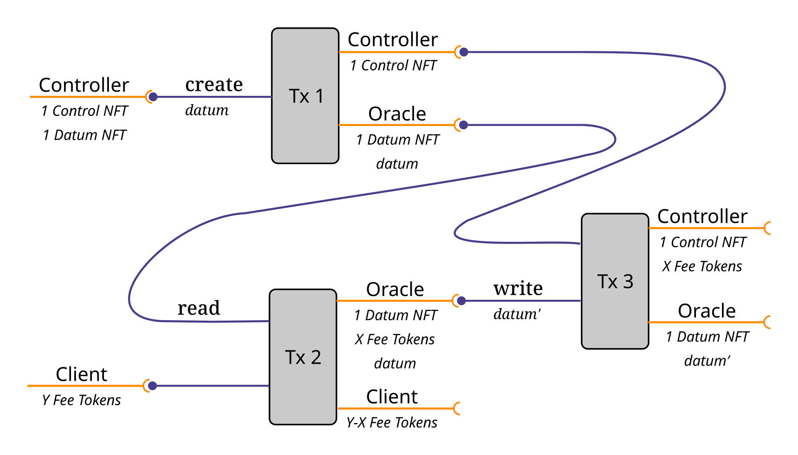

The Mantra Oracle: A General-Purpose Token-Based Oracle for Cardano
===================================================================

This Cardano oracle reports structured data (namely, the `PlutuxTx.BuiltinData` type) to a transaction if the fee, as a quantity of a fungible token, is paid. It can be incorporated into other smart-contract scripts that use the oracle's value in their validation logic.

An example of this oracle in action on `testnet` is described at [https://github.com/pigytoken/pigy-delegation/blob/main/oracle/](https://github.com/pigytoken/pigy-delegation/blob/main/oracle/ReadMe.md).

Parameters
----------

The oracle is parameterized as follows:

    data Parameters =
      Parameters
      {
        controlParameter :: AssetClass
      , datumParameter   :: AssetClass
      , feeToken         :: AssetClass
      , feeAmount        :: Integer
      , lovelaceAmount   :: Integer
      }

*   The `controlParameter` specifies a native token the that controller (owner) of the oracle uses to update the oracle's value, withdraw funds, or close (delete) the oracle.
*   The `datumParameter` specifies the non-fungible token that identifies the UTxO containing the oracle data.
*   The quantity `feeAmount` of the fungible token `feeToken` must be paid to the oracle in order to read its value in an on-chain validator.
*   The quantity `lovelaceAmount` of ADA must be paid to the oracle in order to read its value in an on-chain validator.

Actions
-------

The oracle can perform three simple actions:

    data Action =
        Delete
      | Read
      | Write

*   The `Read` action (see [redeemer-read.json](redeemer-read.json)) simply reads the value of the oracle into a transaction, and corresponds to the `read` endpoint in [`Mantra.Oracle.Client`](src/Mantra/Oracle/Client.hs). The required fee must be paid to the oracle script, and the UTxO containing the oracle data must be consumed and paid back to the oracle script, with the data unchanged.
*   The `Write` action (see [redeemer-write.json](redeemer-write.json)) updates the value of the oracle, and corresponds to the `write` endpoint in [`Mantra.Oracle.Controller`](src/Mantra/Oracle/Controller.hs). The control token (specified by `controlParameter`) must be present in the transaction, and the UTxO containing the oracle data must be consumed and paid back (with the revised data) to the oracle script.
*   The `Delete` action (see [redeemer-delete.json](redeemer-delete.json)) shuts down the oracle by removing the data and associated NFT, and corresponds to the `delete` endpoint in [`Mantra.Oracle.Controller`](src/Mantra/Oracle/Controller.hs). The control token must be present in the transaction.

Usage
-----

The oracle can be incorporated into other smart-contract scripts that use the oracle's value in their validation logic via the `Read` redeemer. Here is an example use case of creating, reading, and writing to the oracle.

Installation
------------

This package uses the [`haskell.nix`](https://input-output-hk.github.io/haskell.nix/) build system. Simply clone this repository and execute the build command:

    nix-build -A mantra-oracle.components.exes.mantra-oracle -o build

The executable result will be in `./build/bin/mantra-oracle`.

Alternatively, one can use the `cabal install` installation approach, which relies on the [cabal.project](cabal.project) file and which is known to succeed with cabal 3.4.0.0 and ghc 8.10.4.

Example using the command line
------------------------------

See [the step-by-step tutorial](Tutorial.md) for detailed instructions for creating, writing, reading, and deleting the oracle using command-line tools.

Simulation and PAB Examples
---------------------------

The oracle can be incorporated into other smart-contract scripts that use the oracle's value in their validation logic via the `readOracleConstraints` function in [`Mantra.Oracle.Client`](src/Mantra/Oracle/Client.hs), which returns the correct lookups, transaction constraints, and datum for a script endpoint to employ the oracle. The `readOracle` function is the simplest example of an endpoint: it just reads the oracle value and performs no other actions.

See the slighly older version of this tool at https://github.com/functionally/mantra-oracle/blob/51d21574dd2a11280ece72068d56ef33f5672404/ReadMe.md for examples use the Plutus simulator and the Plutus Application Backend. Full simulator and PAB support will be included when the PAB is released.

Testing
-------

The [test suite](tests/ReadMe.md) contains 29 tests that provide complete coverage for the logical and redemption of the Plutus validator for the oracle.

API documentation
-----------------

See https://functionally.github.io/mantra-oracle/ for API documentation.

Development environment
-----------------------

Due to quirks in how [`haskell.nix`](https://input-output-hk.github.io/haskell.nix/) and [`cabal.project`](https://cabal.readthedocs.io/en/3.4/cabal-project.html) interact, the following procedure needs to be followed to create a development environment for compiling `mantra`:

1.  Run `nix-shell`. This takes a while to build unless you set `withHoogle = false` in [shell.nix](shell.nix).
2.  Temporarily comment-out the `source-repository-package` lines in [cabal.project](cabal.project).
3.  Run `cabal build`, `hoogle`, or other development tools defined in [shell.nix](shell.nix).
